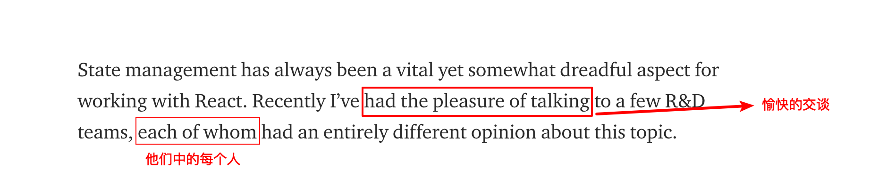

## [State of React State Management fro 2019](https://blog.bitsrc.io/state-of-react-state-management-in-2019-779647206bbc)

### One

State management has always been a vital yet somewhat dreadful aspect for working with React. Recently I’ve had the pleasure of talking to a few R&D teams, each of whom had an entirely different opinion about this topic.   

译著者：R&D资源指的是从事科研与试验发展活动所必需的人力、物力、财力等，R&D teams: 这里指技术开发团队

  
view the definition

  使用`React`开发，状态管理总是一个至关重要但是还让人有些畏惧的方面。最近我有辛和一些开发团队谈论这个问题，关于这个话题他们每个人有完全不同的看法。

  

#### words
* vital
  

    
view the definition

    英 [ˈvaɪtl]  adj. 维持生命所必需的；至关重要的；生机勃勃的
  

* yet
  

    
view the definition

    英 [jet]  adv. 但是；还；已经；又，再 conj. 然而，但是
  

* dreadful
  

    
view the definition

    英 [ˈdredfl]  adj. 可怕的；糟糕的
  

* aspect
  

    
view the definition

    英 [ˈæspekt]   n. 方面；方向；形式
  

### Two
From complaints about Redux making it hard to keep components self-contained to experimenting with the new Context API, most are constantly evaluating for the right solution to pick for their team

  
view the definition

  从关于`Redux`使组件难以维护独立状态的抱怨到尝试新的`Context API`，大多数的人都在不断的评估来为他们的团队选择合适的解决方案。

#### words
* complaint
  

    
view the definition

    英 [kəmˈpleɪnt]  n. 抱怨，控诉；委屈，怨言
  

* constantly
  

    
view the definition

    英 [ˈkɒnstəntli] adv. 不断地，时常的
  

* evalutate
  

    
view the definition

    英 [ɪˈvæljueɪt]  vt. 评价；求...的值（或数）
  

### Three
In this post, I’ll review the state of React state management for the upcoming year, and some popular ways for managing your component states in React. Hopefully, this can help your team save some valuable time, dig deeper and make the right choice. Let’s dive in!

Tip: Use Bit to organize and share React components. Share components your team can use and develop in all your apps and build faster together. Try it out

  
view the definition

  在这篇文章中，我将会回顾最近一年中的`React`状态管理，以及一些流行的管理`React`组件中状态的方法。希望这件事能帮助你的团队节省一些有价值的时间，深挖技术并作出正确的选择。让我们继续深入！

  提示： 使用`Bit`来进行`React`组件的组织和分享。为你的团队分享组件并且一起在你们所有的开发应用中使用组件来更快的构建应用。试试看。

#### words
* review
  

    
view the definition

    英 [rɪˈvju:] n. 复习；回顾；审核；评论
  

* upcoming
  

    
view the definition

    英 [ˈʌpkʌmɪŋ] adj. 即将到来的，即将出现的
  

* dig
  

    
view the definition

    英 [dɪg] vt. 挖掘；探究
  

* organize
  

    
view the definition

    英 [ˈɔ:gənaɪz] v. 组织；安排；规划
  

### Four
React itself provides some useful methods for setting component states using setState() and adding a “local state” to a class.

  
view the definition

  `React`自己提供了一些有用的方法使用`setState()`来设置组件状态并为一个`class`添加一个本地的状态。

With this option, you can call these methods for your components. setState() tells React that this component and its children (sometimes delayed and grouped into a single batch) should be re-rendered with the most updated state, often bases on user-triggered events. setState() will always lead to a re-render as long as an update is available (shouldComponentUpdate()). By adding a “local state” to a class, you can move data from the props themselves onto a state which can be updated

### Five
Managing States with nothing but React itself is entirely possible, but can quickly become ineffective due to scaling complexity and performance issues (dependancies, redundant props, complex trees, etc). So, let’s move on to review React’s Context API- a feature built to solve exactly that

### Six
The new React Context API, officially recommended from version React’s version 16.3.0, solves a major problem when setting component states: it lets you pass data through the component tree without having to manually pass props at every level of the tree even when not needed (prop drilling)

### Eight
Using the context API you can share values between components without having to pass props. So far, the React team recommends using it to “share data that can be considered “global” for a tree of React components, such as the current authenticated user, theme, or preferred language”. You might still need to add some code to compose providers and consumers (see this library), but no doubt this new “first-class” feature in React is a game changer.
#### Words
* authenticate
  

    
view the definition

    英 [ɔ:ˈθentɪkeɪt]  vt. 鉴定；使生效；证明是真实的
  

* prefer
  

    
view the definition

    英 [ɔ:ˈθentɪkeɪt]  vt. 更喜欢；提升；偏爱；优先权  变形：n.preference, 过去式：preferred
  

* compose
  

    
view the definition

    英 [kəmˈpəʊz]  vt. 组成，构成；创作（乐曲、诗歌等）；为...谱曲
  
