## `Getting Started`
> This page is an overview of the React documentation and related resources

  
view the definition

  这是一个`React`文档和相关资源的概览页面

* overview
  

    
view the definition

    英 [ˈəʊvəvju:] n. 概观；总的看法；回顾，复习
  

React is a JavaScript library for building user interfaces. Learn what React is all about on our homepage or in the tutorial.

* interface
  

    
view the definition

    英 [ˈɪntəfeɪs] n. 界面；接口  

    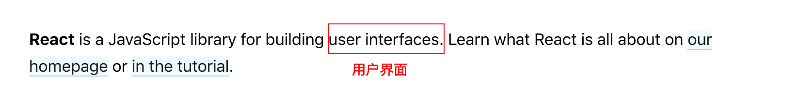
  

* Try React
* Learn React
* Staying Informed ： 获取最新信息
* Versioned Documentation
* Something Missing?

## Try React
React has been designed from the start for gradual adoption, and you can use as little or as much React as you need. Whether you want to get a taste of React, add some interactivity to a simple HTML page, or start a complex React-powered app, the links in this section will help you get started.

  
view the picture

  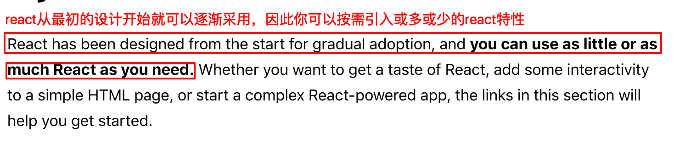

### Words
* gradual
  

    
view the definition

    英 [ˈgrædʒuəl] adj. 逐渐的；平缓的
  

* adopt
  

    
view the definition

    英 [əˈdɒpt] vt. 采用，采纳；收养；接受；批准

    adoption: n. 采用，收养
  

* taste
  

    
view the definition

    英[teɪst] n. 味道；滋味 v. 品尝；体验
  

## Online Playgrounds
if you’re interested in playing around with React, you can use an online code playground. Try a Hello World template on CodePen, CodeSandbox, or Glitch.

If you prefer to use your own text editor, you can also download this HTML file, edit it, and open it from the local filesystem in your browser. It does a slow runtime code transformation, so we’d only recommend using this for simple demos.

  
view the picture

  
  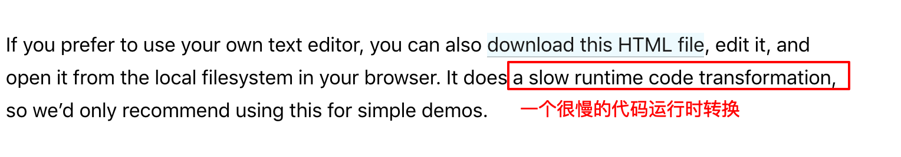

## Add React to a Website
You can add React to an HTML page in one minute. You can then either gradually expand its presence, or keep it contained to a few dynamic widgets.

  
view the picture

  
  

### Words
* present
  

    
view the definition

    英 [ˈpreznt] adj. 现在的；出席的； n. 现在；礼物；瞄准 vt. 介绍；出现

    presence n. 出席；仪表；风度
  

* dynamic
  

    
view the definition

    英 [daɪˈnæmɪk] adj. 动态的；动力的； n. 动态；动力；活力
  

* widget
  

    
view the definition

    英 [ˈwɪdʒɪt] n. 小器具；装饰品；窗口小部件
  

## Create a New React App
When starting a React project, a simple HTML page with script tags might still be the best option. It only takes a minute to set up!

As your application grows, you might want to consider a more integrated setup. There are several JavaScript toolchains we recommend for larger applications. Each of them can work with little to no configuration and lets you take full advantage of the rich React ecosystem.

  
view the picture

  
  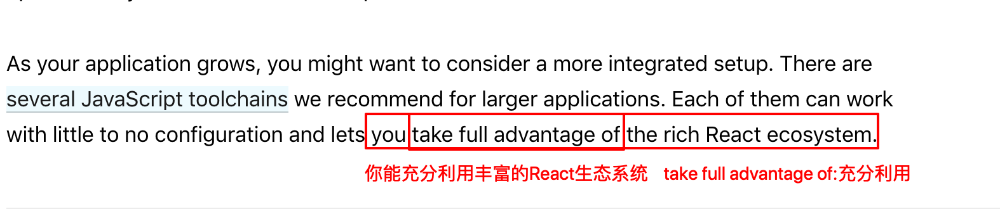

### Words
* advantage
  

    
view the definition

    英 [ədˈvɑ:ntɪdʒ] n. 有利条件；益处；优越（性） vt. 有利于；促进
    
    take full advantage of : 充分利用
  

## Learn React
People come to React from different backgrounds and with different learning styles. Whether you prefer a more theoretical or a practical approach, we hope you’ll find this section helpful.

* If you prefer to learn by doing, start with our practical tutorial.
* If you prefer to learn concepts step by step, start with our guide to main concepts.

Like any unfamiliar technology, React does have a learning curve. With practice and some patience, you will get the hang of it.

  
view the picture

  
  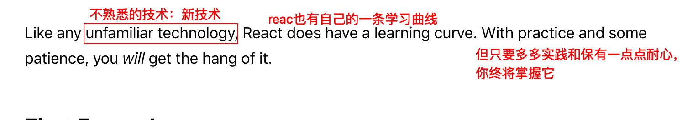
  
  get the hang of : 熟悉某物的用法；掌握做某事的窍门

### Words
* theoretical
  

    
view the definition

    英 [ˌθɪəˈretɪkl] adj. 理论的；推想的，假设的；
  

  
* curve
  

    
view the definition

    英 [kɜ:v] n.弧线，曲线； vi. 使弯曲
  

## First Examples
The React homepage contains a few small React examples with a live editor. Even if you don’t know anything about React yet, try changing their code and see how it affects the result. 

  
view the picture

  
  

## React for Beginners
If you feel that the React documentation goes at a faster pace than you’re comfortable with, check out this overview of React by Tania Rascia. It introduces the most important React concepts in a detailed, beginner-friendly way. Once you’re done, give the documentation another try!

  
view the picture

  give ... another try: 再来一次
  
  give the documentation another try: 再来试着读一次文档
  
  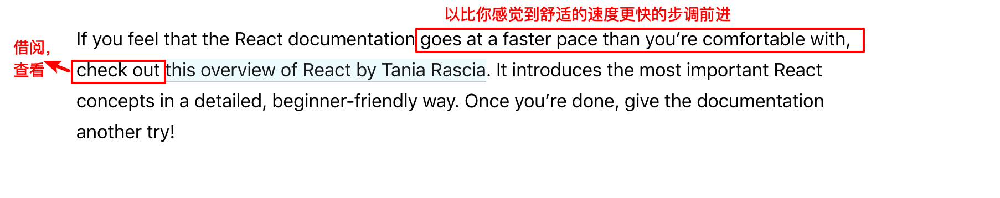

### Word
* pace
  

    
view the definition

    英 [peɪs] n. 一步；长度单位 vt. 踱步 vi.
  

  
* check out
  

    
view the definition

    n. 结账离开；得到证实；获得证明；借阅；查看
  

## React for Designers
if you’re coming from a design background, these resources are a great place to get started.

## JavaScript Resources
The React documentation assumes some familiarity with programming in the JavaScript language. You don’t have to be an expert, but it’s harder to learn both React and JavaScript at the same time.

We recommend going through this JavaScript overview to check your knowledge level. It will take you between 30 minutes and an hour but you will feel more confident learning React.

> #### Tip
>  Whenever you get confused by something in JavaScript, MDN and javascript.info are great websites to check. There are also community support forums where you can ask for help.

  
view the picture

  
  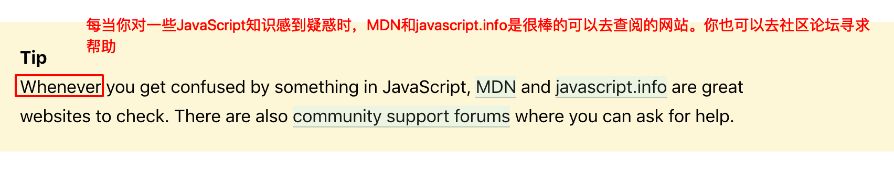

### Words
* expert
  

    
view the definition

    英 [ˈekspɜ:t] n. 专家，能手
  

  
* confident
  

    
view the definition

    英 [ˈkɒnfɪdənt] adj. 确信的，深信的,有信心的 n. 知己，心腹
  

  
* confuse
  

    
view the definition

    英 [kənˈfju:z] vt. 使混乱；使困惑 vi.使糊涂
    
    confused: adj. 不清楚的，困惑的； v.困惑(confuse的过去式)
  

## Practical Tutorial
If you prefer to learn by doing, check out our practical tutorial. In this tutorial, we build a tic-tac-toe game in React. You might be tempted to skip it because you’re not building games — but give it a chance. The techniques you’ll learn in the tutorial are fundamental to building any React apps, and mastering it will give you a much deeper understanding

## Step-by-Step Guide
If you prefer to learn concepts step by step, our guide to main concepts is the best place to start. Every next chapter in it builds on the knowledge introduced in the previous chapters so you won’t miss anything as you go along

  
view the picture

  
  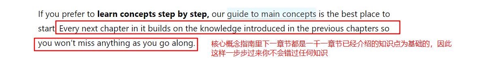

### Word
* chapter
  

    
view the definition

    英 [ˈtʃæptə(r)] n.章，回；（俱乐部，协会等）的分会；人生或历史上的重要时期  vt. 把...分成章节
  

## Thinking in React

Many React users credit reading Thinking in React as the moment React finally “clicked” for them. It’s probably the oldest React walkthrough but it’s still just as relevant

  
view the picture

  
  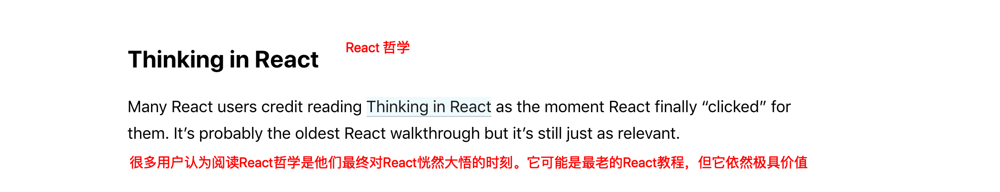

### Word
* credit
  

    
view the definition

    英 [ˈkredɪt] n. 信誉，信用；贷款；荣誉；学分 vt. 相信，信任；归功于；赞颂
  

* walkthrough
  

    
view the definition

    英 ['wɔ:kθru:] n. 预排；游戏攻略，指完整的游戏攻关指导
  

## Recommended Courses
Sometimes people find third-party books and video courses more helpful than the official documentation. We maintain a list of commonly recommended resources, some of which are free.

### Word
* maintain
  

    
view the definition

    英 [meɪnˈteɪn] vt. 维持；继续；维护；主张；供养
  

## Advanced Concepts
Once you’re comfortable with the main concepts and played with React a little bit, you might be interested in more advanced topics. This section will introduce you to the powerful, but less commonly used React features like context and refs.

## API Reference
This documentation section is useful when you want to learn more details about a particular React API. For example, React.Component API reference can provide you with details on how setState() works, and what different lifecycle methods are useful for

  
view the picture

  
  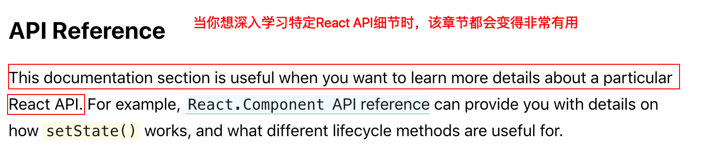

### Word
* particular
  

    
view the definition

    英 [pəˈtɪkjələ(r)] adj. 特别的；详细的；独有的 n. 特色，特点；（可分类，列举的）项目；细节；某一事项
  

## Glossary and FAQ
The glossary contains an overview of the most common terms you’ll see in the React documentation. There is also a FAQ section dedicated to short questions and answers about common topics, including making AJAX requests, component state, and file structure.

### Word
* glossary
  

    
view the definition

    英 [ˈglɒsəri] n. (书尾的)词汇表，难词汇编

    FAQ: frequently asked questions: 常见问题与解答；常见问答集；直译：常被问到的问题
  

## Staying Informed
The React blog is the official source for the updates from the React team. Anything important, including release notes or deprecation notices, will be posted there first.

You can also follow the @reactjs account on Twitter, but you won’t miss anything essential if you only read the blog.

Not every React release deserves its own blog post, but you can find a detailed changelog for every release in the CHANGELOG.md file in the React repository, as well as on the Releases page

  
view the picture

  
  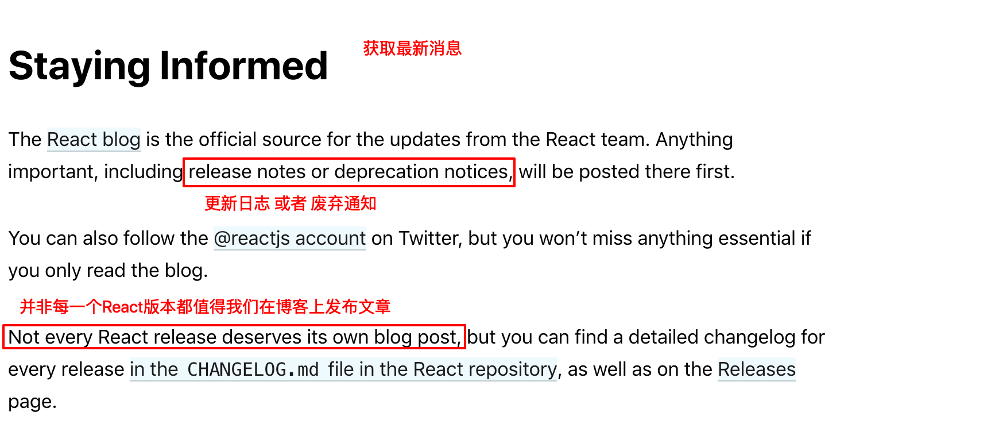

## Versioned Documentation
This documentation always reflects the latest stable version of React. Since React 16, you can find older versions of the documentation on a separate page. Note that documentation for past versions is snapshotted at the time of the release, and isn’t being continuously updated.

  
view the picture

  
  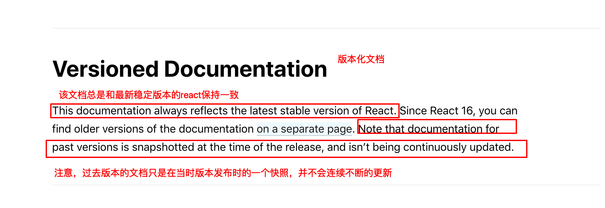

### Word
* reflect
  

    
view the definition

    英 [rɪˈflekt] v. 反射，反照；表达；显示；折转；映射
  

* snapshot
  

    
view the definition

    英 [ˈsnæpʃɒt] n. (快照)照片，独立的印象，简单印象；简介；v.拍快照
  

## Something Missing?
If something is missing in the documentation or if you found some part confusing, please file an issue for the documentation repository with your suggestions for improvement, or tweet at the @reactjs account. We love hearing from you!

### Word