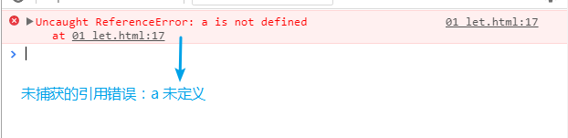

### 单词01
* grow
  

    
view the definition

    英 [grəʊ] vt. 种植，增加，扩大(`flex-grow`:定义项目的扩大比例【伸缩布局】)
  

* shrink
  

    
view the definition

    英 [ʃrɪŋk] vt. 收缩；皱缩；退缩
  

* identifier
  

    
view the definition

    英[aɪˈdentɪfaɪə(r)] n. 识别符；检验人；鉴别器；编号
    
  

* reference(ref in react and vue is this means)
  

    
view the definition

    英[ˈrefrəns] n. 参考；谈到；引用

    
  

* issue
  

    
view the definition

    英 [ˈɪʃu:] n. 问题；（报刊的）期，号；发行物；流出 vt. 发行，发布

    * social issue: 社会问题
    * date issue: 发布日期
  

* trigger
  

    
view the definition

    英 [ˈtrɪgə(r)] n. (枪)扳机；启动装置；[电子学]触发器，触发电器  vt. 引发，触发
  

* optimize
  

    
view the definition

    英[ˈɒptɪmaɪz] vt. 使最优化，使尽可能有效
  

* purpose
  

    
view the definition

    英[ˈɒptɪmaɪz] n. 意志；目的；作用；（进行中）的行动 vt. 打算，企图
  

* interceptor
  

    
view the definition

    英 [ˌɪntəˈseptə(r)] n. 拦截器
  

* unexpected
  

    
view the definition

    英 [ˌʌnɪkˈspektɪd] adj. 想不到的，意外的，忽然的
  
