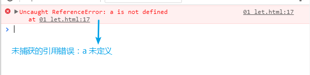

### 单词01
* grow
  

    
view the definition

    英 [grəʊ] vt. 种植，增加，扩大(`flex-grow`:定义项目的扩大比例【伸缩布局】)
  

* shrink
  

    
view the definition

    英 [ʃrɪŋk] vt. 收缩；皱缩；退缩
  

* identifier
  

    
view the definition

    英[aɪˈdentɪfaɪə(r)] n. 识别符；检验人；鉴别器；编号
    
  

